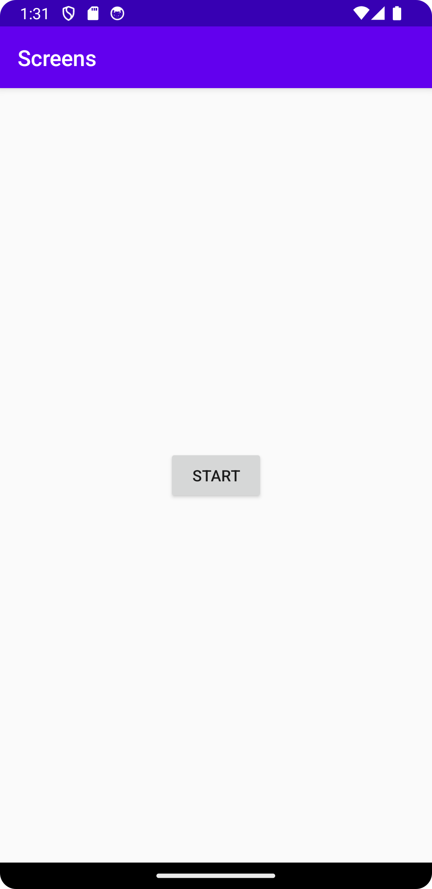

# Rapport

Först skapades en ny aktivitet samt tillhörande layout-fil. Aktiviteten döptes till SecondActivity.java och xml-filen blev activity_second.xml

Inuti den första layout-filen "activity_main.xml" skapades en knapp med id:t "knapp". Knappen innehåller en string av text som hittas inuti "strings.xml"

```
 <Button
        android:id="@+id/knapp"
        android:text="@string/button_main"
        android:layout_width="wrap_content"
        android:layout_height="wrap_content"
        app:layout_constraintBottom_toBottomOf="parent"
        app:layout_constraintLeft_toLeftOf="parent"
        app:layout_constraintRight_toRightOf="parent"
        app:layout_constraintTop_toTopOf="parent" />
```
```
 <string name="button_main">Start</string>
```
För att knappen ska kunna starta den nya aktiviteten lades kod till i MainActivity.Java
Knappen hittas genom id:t "knapp" och sedan används en OnClickListener med kod som specifierar vad som händer när knappen blir nedtryck.
Med en intent startar aktiviteten genom att säga vilken aktivitet vi startar på (MainActivity) och vilken aktivitet som är desitinationen (SecondActivity). 
```
    @Override
    protected void onCreate(Bundle savedInstanceState) {
        super.onCreate(savedInstanceState);
        setContentView(R.layout.activity_main);

        Button button = findViewById(R.id.knapp);
        button.setOnClickListener(new View.OnClickListener() {
            public void onClick(View v) {
                Intent intent = new Intent(MainActivity.this, SecondActivity.class);
                startActivity(intent);
            }
        });

    }
```
Jag stötte på ett problem där appen kraschade när knappen trycktes ned. Detta löstes genom att ändra AndroidManifest.xml, där min SecondActivity inte lagts till ännu.
När aktiviteten deklarerats funkade appen.
```
 <activity android:name=".SecondActivity"/>
```
Sedan lades kod till för att skicka data med extras från MainActivity. Värdet för name är j21marda (string) och värdet för number är 21 (int)
```
    public void onClick(View v) {
        Intent intent = new Intent(MainActivity.this, SecondActivity.class);
        intent.putExtra("name", "j21marda");
        intent.putExtra("number", 21);
        startActivity(intent);
    }
```
För att datan ska kunna användas av SecondActivity lades kod till som hämtar min string och min int, *om* extras existerar.
```
    @Override
    protected void onCreate(Bundle savedInstanceState) {
        super.onCreate(savedInstanceState);
        setContentView(R.layout.activity_second);

        Bundle extras = getIntent().getExtras();
        if (extras != null) {
            String name = extras.getString("name");
            int number = extras.getInt("number");
        }
    }
```
För att visa upp datan i SecondActivity skapades två textviews i activity_second.xml
Ena viewen ska visa text, tillsammans med data från "name", den andra visar text, tillsammans med data från "number".
Varje textview får ett id.

```
    <TextView
        android:id="@+id/textName"
        android:text="@string/extra_name"
        android:layout_width="wrap_content"
        android:layout_height="wrap_content"
        app:layout_constraintTop_toBottomOf="@id/hello"
        app:layout_constraintStart_toStartOf="parent"
        app:layout_constraintEnd_toEndOf="parent"/>

    <TextView
        android:id="@+id/textNumb"
        android:text="@string/extra_number"
        android:layout_width="wrap_content"
        android:layout_height="wrap_content"
        app:layout_constraintTop_toBottomOf="@id/textName"
        app:layout_constraintStart_toStartOf="parent"
        app:layout_constraintEnd_toEndOf="parent"/>
```
Texten mina textviews visar skapas inuti strings.xml

```
    <string name="extra_name">By student: </string>
    <string name="extra_number">The number is: </string>
```
För att SecondActivity ska visa text ur textviews samt extra-datan från intent, läggs ytterligare kod till i java-filen.
Först hämtas referenser till mina textviews genom "findViewById".
Inuti koden som körs om extras inte är noll, används "setText" för varje textview tillsammans med "getString" som hämtar dess strings. 
Sedan läggs "+ name" och "+ number" till på respektive rad för att slå ihop dess data med textview-stringsen.

```
    @Override
    protected void onCreate(Bundle savedInstanceState) {
        super.onCreate(savedInstanceState);
        setContentView(R.layout.activity_second);

        TextView textName = findViewById(R.id.textName);
        TextView textNumb = findViewById(R.id.textNumb);

        Bundle extras = getIntent().getExtras();
        if (extras != null) {
            String name = extras.getString("name");
            int number = extras.getInt("number");

            textName.setText(getString(R.string.extra_name) + name);
            textNumb.setText(getString(R.string.extra_number) + number);
        }
    }
```
Resultat:
MainActivity

SecondActivity


